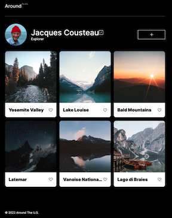

# Around The U.S.

## Table Of Contents
1. [Intro](#intro)
2. [Figma](#figma)
4. [Project Videos](#project-videos)
  
## Intro
  
This project, entitled, "Around The U.S." is a project to demonstrate the basics
of HTML, CSS, and Javascript. It is made with the intention of introducing the concepts
of grid boxes, flex boxes, fonts, media queries, section definitions, modals, and
basic page renderings, along with other HTML and CSS concepts.

The end result of this project is the culmination of three sprint's worth of work, in which the aforementioned concepts and list of technologies (list growing) are introduced during through interactive
lessons.
  
## Figma
  
* [Sprint 3 Figma Design](https://www.figma.com/file/ii4xxsJ0ghevUOcssTlHZv/Sprint-3%3A-Around-the-US?node-id=0%3A1)

## Project Videos
### __Click Images to See Video Content__

Sprint 3:  

